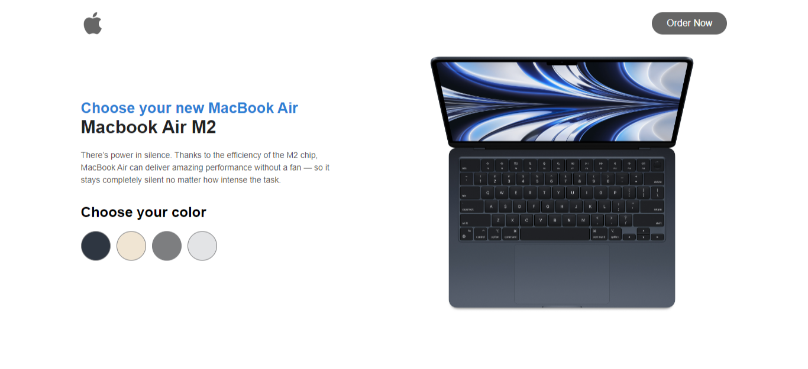

<div align="center">

  <h2 align="center">Macbook Air M2 Landing Page</h2>

  In this project, I have created Macbook Air M2 Landing Page with color variant, The project is built using HTML5, CSS3 & Javascript.

  <a href="https://github.com/Seemikumari/macbook-air-m2-landing-page"><strong>➥ Live Demo</strong></a>

</div>

### Demo Screeshots



### Prerequisites

Before you begin, ensure you have met the following requirements:

* [Git](https://git-scm.com/downloads "Download Git") must be installed on your operating system.

### Run Locally

To run **macbook-air-m2-landing-page** locally, run this command on your git bash:

Linux and macOS:

```bash
sudo git clone https://github.com/Seemikumari/macbook-air-m2-landing-page.git
```

Windows:

```bash
git clone https://github.com/Seemikumari/macbook-air-m2-landing-page.git
```

### Contact

If you want to contact me you can reach me at [Instagram](https://www.instagram.com/realistic_bee/).

### License

This project is **free to use** and does not contains any license.
